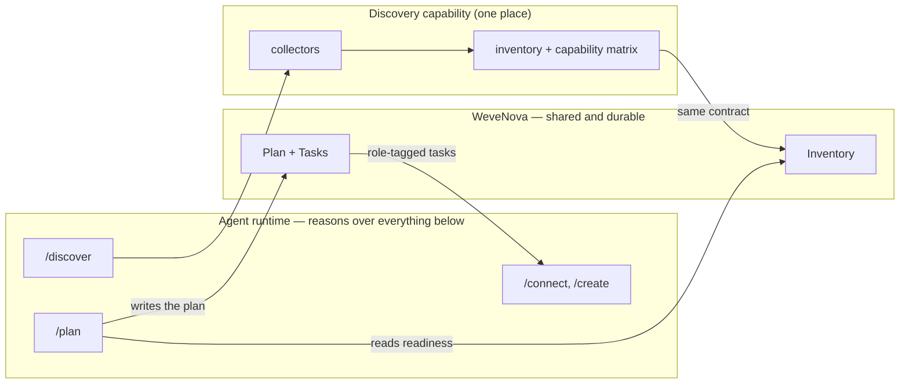
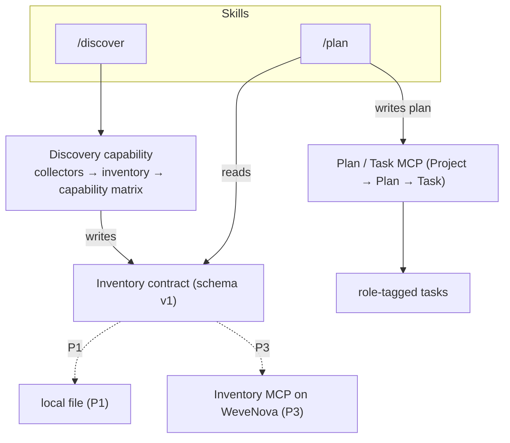
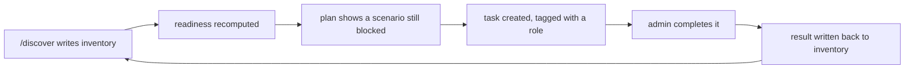
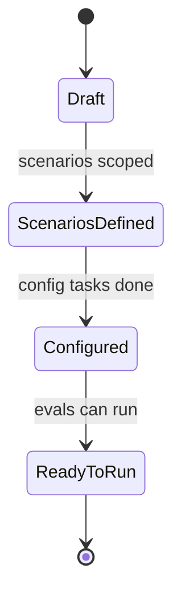
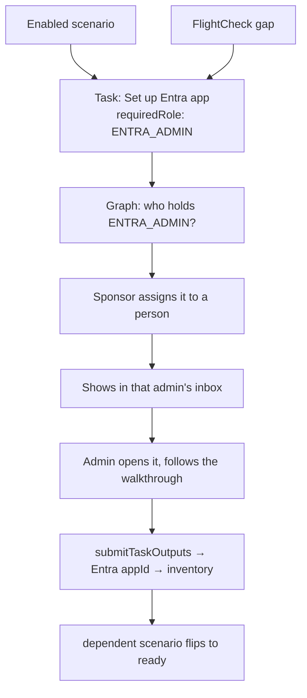
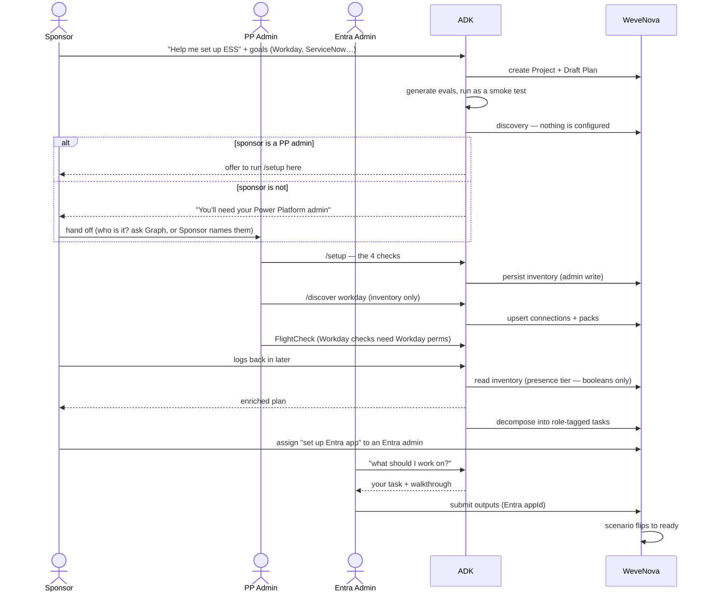
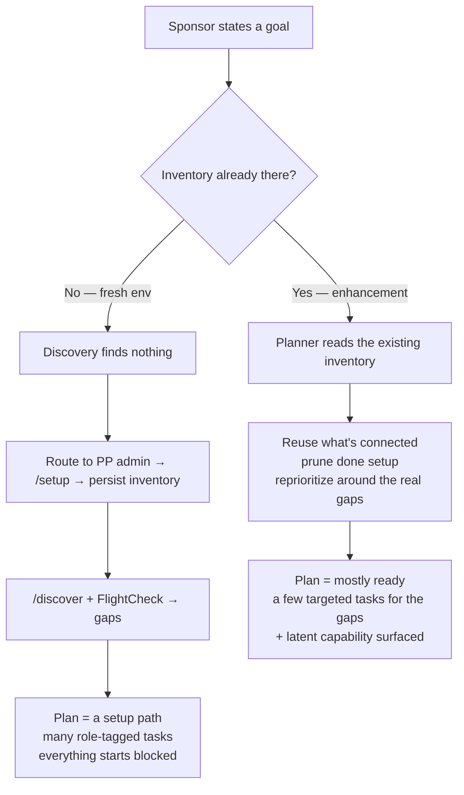

# Pulling ESS discovery together, and building a planner that knows the tenant

**Status:** Draft for review
**Audience:** ADK / Cocreate engineering
**Companion specs (proposed alongside this design):** the inventory contract + schema and the WeveNova alignment spec (the `InventoryItem` shape and the read-redaction rules), plus the Learn-grounding notes. **External references:** the Cocreate AgentConfiguration V2 design and the scenario-plan storage one-pager.

---

## The short version

Discovery in ADK is scattered across a handful of scripts and FlightCheck, and none of them leave behind anything reusable. We want to pull all of it into one place that produces a single artifact — an **inventory** of the tenant — and then build a **planner** on top of it that gives a sponsor a rollout plan grounded in what they actually have, instead of a generic checklist.

Both the inventory and the plan eventually live in **WeveNova**, so a sponsor and an admin can share them. The work needed to make each scenario real shows up as **role-tagged tasks** an admin can pick up. This doc explains how the pieces fit and how they ship.

The picture, end to end:



---

## What we're actually fixing

Three problems, in plain terms.

**Discovery is spread out.** Environment lookup is in one script, agent lookup in another, component extraction in a third, and the interesting part — connections, flows, knowledge sources — only runs inside FlightCheck, where it turns into pass/fail rows and vanishes. There's no way to just ask "what's set up in this tenant?" and get a durable answer back.

**Plans are generic.** If we don't read the tenant, the best we can do is repeat the catalogue's default order. We can't say "start here, because that's the thing that's actually blocking your highest-value scenarios," or "you already have SAP connected, so the manager scenarios are nearly free."

**There's no shared picture of the tenant.** The little state we capture today — the setup `config.json` and the agent `snapshot.md` — sits as local files on whoever ran setup, and it only describes one agent, not the tenant's connectors. So the person who *sets ESS up* (a Power Platform admin) and the person who *plans it* (a sponsor), usually different people on different machines, have nothing in common to look at.

---

## Goals, and what we're leaving alone

**We want to:**
- Have one discovery capability that emits one stable, versioned inventory.
- Build a planner that reasons over that inventory plus the scenario catalogue plus Microsoft Learn, and cites its sources.
- Put the inventory and the plan in WeveNova, exposed as MCP tools, in a way that lets us decide "one server or two" later without rework.
- Keep everything close to how Agent Skills and MCP servers are normally built, and let the model reason rather than following a hardcoded script.

**We're deliberately not:**
- Rewriting Cocreate's authorization or merge model — we use its `verify` and its fork/commit machinery as-is.
- Publishing to the live agent, or doing the actual connector setup (that stays in `/connect`), or building the approvals/notifications subsystem.

---

## The one idea that keeps this simple: don't script it

The biggest design choice here is a style choice. **Deterministic work is a tool; judgment is the model's.**

Crawling an API, computing an idempotency key, upserting a record — those are tools: typed, idempotent, testable. Choosing which scenarios to enable, what order to do them in, how to weigh deflection against governance risk — that's the model's job, guided by a skill that hands it the right context and a few guardrails.

So the skills stay short. Each one is a small `SKILL.md`: a name and a description that tells the runtime when to reach for it, a behavioral brief, and pointers to reference data it loads only when needed. We don't bake a rigid step-by-step into a planning skill, because planning isn't a fixed sequence. (The existing Message-block skills — onboarding, connect — are fine *because* setup really is a fixed sequence. Planning isn't.)

A few guardrails ride along on every skill: ground claims and cite them, never invent a URL, trace every readiness call to a real fact in the inventory, don't show identifiers to someone who shouldn't see them, and confirm anything destructive. Beyond that, the model reasons.

---

## Where discovery lives today (and why it needs pulling together)

| What gets discovered | Where it lives now | What comes out | The problem |
|---|---|---|---|
| Environments | `list_environments.py` | a printed list | one-shot, not saved |
| Agents (bot id, schema) | `discover.py` | stdout / `config.json` | partial |
| Topics, variables, template configs, workflows | `fetch_and_setup.py` → `setup.py` | the extracted agent folder + `snapshot.md` | agent-only, silent on connectors |
| Connections, flows, packs | FlightCheck (`pp_admin_client`, `external_systems`) | pass/fail rows in a report | ephemeral, FlightCheck-only |
| Knowledge-source state | FlightCheck (`pva_client`) | pass/fail rows | ephemeral, FlightCheck-only |
| Auth + Dataverse queries | `auth.py` | — | shared, and fine as-is |

The forward work is to introduce one discovery module: a `scripts/discovery/` package — collectors, an inventory model, and a capability matrix — with an orchestrator on top. The collectors are thin wrappers over the same clients the table above already uses. That module becomes *the* discovery capability, the scattered scripts turn into thin front-ends over it, and then it's pointed at WeveNova.

---

## The target shape

Everything hangs off two stable seams, and those seams are what make the whole thing reversible.

The **inventory contract** (`inventory.schema.json`) is what consumers read. Whether it's backed by a local file today or a WeveNova tool tomorrow doesn't matter to them — the shape is the same, so we can swap the backing without touching a single consumer.

The **MCP namespace** (`inventory.*`, `plan.*`) is what the runtime calls. Whether those are served by one MCP server or two is a deployment detail. As long as the tool names hold, the client doesn't care.



---

## Consolidating discovery

The rule is simple: **one capability, many thin front-ends.**

Build a `scripts/discovery/` package as the single source of truth. Its collectors are thin adapters over the clients we already trust (`auth`, `pp_admin_client`, `pva_client`), so we're not signing up for any new external API to verify.

Then fold the strays in. `discover.py` and `list_environments.py` become collectors the orchestrator calls, not standalone truth — their CLIs can stick around as thin wrappers for setup's step-by-step flow. FlightCheck's connection and knowledge-source detection moves into the shared collectors (it already calls the same clients), so there's one code path instead of two. FlightCheck stays the deep validator; the inventory is the lightweight, reusable snapshot.

The orchestrator exposes three modes:
- `baseline`: build from what's already on disk, no extra sign-in. Setup runs this so an inventory always exists.
- `refresh`: the full live crawl.
- `reconcile`: fold in whatever `/connect` captured.

That same interface becomes the write side of the Inventory MCP later — a `refresh` is just a batch of `upsertItem` calls.

---

## The planner skill

### What it looks like
We add a short planner skill (`src/skills/plan/SKILL.md`): a name, a description that trips when someone asks to plan a rollout, and a behavioral brief. The brief says *what to reason about and where the guardrails are* — not a rigid script. It points at the inventory schema, the Learn anchors, and the scenario catalogue as reference data.

### What it reasons over
Four inputs:
1. **The inventory** — connectors, packs, knowledge sources, template configs, agents, and the readiness matrix, plus anything that's currently broken.
2. **The scenario catalogue** — the 43 out-of-the-box scenarios plus the extensible ones, the connector map, the prioritization criteria, the adoption lifecycle.
3. **Microsoft Learn** — the actual setup and prerequisite detail, grounded and cited on the spot.
4. **The execution substrate** — so an accepted plan becomes a real, trackable Project → Plan → Task.

### How it stays flexible
The skill hands the model capability and guardrails and lets it think. It does *not* hardcode the phases. The plan falls out of the inventory: put the biggest blocker first, quantify what fixing it unlocks, surface connectors the sponsor forgot they had, tell them which scenarios only need a topic authored because the config already exists, flag the ones that look ready but would fail a pilot, route each remaining task to the right owner, and skip whatever's already done. (Appendix B walks through a real example of this.)

### Handing off to execution
When the sponsor accepts a plan, the skill creates a Project for the agent, mints a Plan, and turns the remaining work into tasks — skipping what the inventory shows is already done, pre-filling values it already knows (environment id, connector references), and gating tasks whose prerequisites aren't met yet. This is the moment "pruning" becomes concrete: the task list is the *remaining* work, computed from the tenant, not the catalogue's full menu.

---

## The MCP surfaces

Two tool namespaces over the same AgentConfiguration substrate. Both follow the usual MCP shape: typed tools, stateless and idempotent, paginated, auth handled by the host, and big read-mostly context exposed as resources rather than stuffed into tool results.

### Inventory (`inventory.*`, WeveNova-backed)
This mirrors the alignment spec.
- `inventory.upsertItem(...)` — idempotent by `(kind, naturalKey)`, admin-gated on write. A discovery refresh is a batch of these with `assertedVia: "adk-discover"`.
- `inventory.get(...)` / `inventory.getItem(id)` — a **role-tiered read**: the server decides Full vs Presence from `verify`; the caller can't ask for Full.
- `inventory.resolveRef(ref)` — tier-aware, so it never leaks identifiers to a presence caller.
- `inventory.retire(id, ifMatch)` — soft-retire on drift, and only for items discovery itself asserted.
- Resources: `inventory://snapshot`, `inventory://capability-matrix`, `inventory://schema`.

### Plan and tasks (`plan.*`, Project → Plan → Task)
- `plan.getOrCreateProject`, `plan.createPlan` (Draft), `plan.patchPlan(Scenarios[], Phase, EvalState, Roles[])` — the scenario-scope layer (mint early, edit in place; see the persistence section).
- `plan.forkPlan` — the config working-copy layer.
- `plan.decomposeScenario` — spawn config tasks (from connect-step templates and FlightCheck gaps), each stamped with a `requiredRole`.
- `plan.listRoleHolders(role)`, `plan.assignTask(taskId, principalId)` — the assignment flow.
- `plan.getMyTasks` / `plan.getTasksForRole` — the "what should I work on?" inbox.
- `plan.submitTaskOutputs`, `plan.getConfigFieldValues`, `plan.readProjection`, `plan.commit` — the completion gate, value reads, and merge-back.
- Resources: `plan://catalog`, `plan://project/{id}`.

### One server or two?
Start with **one server, two namespaces.** It's simpler for the runtime to reason about a single endpoint, inventory and plan sit on the same substrate, and resolving an `InventoryRef` from a plan crosses the two — keeping them together avoids a network hop and a cross-server auth dance.

Split later if ownership diverges, if the inventory read tier needs its own scaling, or if something other than the planner starts consuming inventory. The client won't notice, as long as `inventory.*` and `plan.*` stay stable. That stability is the real contract — not the process boundary.

---

## How a plan gets iterated and stored

The planner produces a **scenario plan**: the sponsor's goals, a prioritized list of scenario areas, the connectors each needs, the dependencies, and the roles. Where does it live, and how does it change over time?

### Three things, three homes — don't mix them up

| Thing | What it is | Home | Who writes / reads |
|---|---|---|---|
| **Inventory** | tenant state (connectors, packs, knowledge, template configs) | WeveNova Inventory (`inventory.*`) | admin writes via discovery; sponsor reads the presence view |
| **Scenario plan** | the rollout scope: goals + `Scenarios[]` + roles | WeveNova Plan (`Plan.Scenarios[]`, `plan.*`) | sponsor authors via the planner; eval-gen and execution read it |
| **Tasks** | the work to make each scenario real, each with a role | WeveNova Execution Plan capability | derived from scenarios + FlightCheck gaps; assigned to role-holders |

Local files are just staging: `config.json` (the admin's setup state), and `inventory.json` / `plan.json` as contract mirrors until the MCP lands.

### Where the plan should live: WeveNova, not a laptop

Put the scenario plan in `Plan.Scenarios[]`, the way the storage one-pager lays out — not on the sponsor's disk. The reason is right there in the flow below: the sponsor scopes it, a *different* admin sets things up, the sponsor comes back and refines it, eval generation reads it, and execution turns it into tasks. A local file can't be read by the admin, doesn't survive a new machine, and can't feed the two things downstream that depend on it. **Once two people are involved, the plan has to be shared.**

"Keep the plan local but create tasks in WeveNova" is the tempting middle ground, and it's wrong: tasks are derived from the scenario list and point back at each scenario by id. If the tasks are in WeveNova, the scenarios have to be too.

### The interim, so we're not blocked on the backend
The new `Plan` fields (`Scenarios[]`, `Phase`, `EvalState`, multiple active plans) are an ask on the backend team. Until they land, the planner stages the plan in a local `plan.json` shaped exactly like `Plan.Scenarios[]`, and syncs it up with `patchPlan` when the fields exist. Same trick as the inventory: stable contract, swappable backing. So this was never "local *or* WeveNova" — it's local-as-cache, WeveNova-as-truth.

### Why storing it enriched is the whole point

Here's the payoff. Every scenario entry carries the status of its dependencies (`met` / `unmet` / `pending`) and whether it's `ready`. Those come straight from the inventory. So the sponsor scopes some scenarios that start out `unmet` (no connector yet); the admin runs setup and `/discover`; and the *same* stored plan flips those entries from `unmet` to `met` to `ready` — nobody re-scopes anything. The plan turns into a shared status board, where the admin's progress shows up as the sponsor's readiness.



### How the plan moves through its life
- Mint a Draft Plan **early**, even sparse — that's what lets us check new requests against active plans.
- Edit it in place with `patchPlan` as goals, tech stack, and governance firm up. Disabling a scenario isn't deleting it — we flip `enabled: false` and keep the entry, so "add it back once Workday's connected" is a re-enable, not a re-scope.
- Roll readiness up into an `EvalState`:



### What we don't store
The planner owns the scenario plan and nothing else. Eval generation and eval storage belong to a separate (Neha's) skill that *reads* our enabled scenarios. Tasks belong to the execution capability. There are no golden prompts and no run results in our model — it stops at scope. Let's keep that boundary clean.

---

## Tasks are real work, tagged with a role

This is the part that turns a plan into something that gets done.

A task in WeveNova is a unit of execution work, and every task carries the **role** needed to do it. Two places feed the task list, and they share one shape:

- **The `/connect` step lists.** Each concrete admin action in `/connect workday` — set up the Entra app for SSO, register the Workday API client, install the extension pack, create the connections — becomes a task. The step's existing walkthrough becomes the task's how-to.
- **FlightCheck findings.** Every failing or manual check already names an owner and a fix, so it drops straight in as a task with that role.

We reuse the role names FlightCheck already uses — `ENTRA_ADMIN`, `M365_ADMIN`, `POWER_PLATFORM_ADMIN`, `WORKDAY_ADMIN`, `SERVICENOW_ADMIN`, `SAP_ADMIN`, `ESS_MAKER` (plus Experience Manager). So "set up the Entra app" is a task whose `requiredRole` is `ENTRA_ADMIN`. That one vocabulary ties together what's missing (FlightCheck) and how to fix it (the connect steps).

The flow the sponsor sees, and the one the admin sees, are two halves of the same loop:



Concretely: the sponsor sees a task and its required role. ADK offers a short list of people who actually hold that role — pulled from Microsoft Graph (the kit's `graph_client` already reads directory roles) — or the sponsor just names someone. The sponsor assigns it. Later, when that Entra admin comes to ADK and asks "what should I work on?", the task is sitting in their inbox with its walkthrough attached. They do it, the result (the Entra app id) gets written back to the inventory, and the scenario that was waiting on it flips to ready. The sponsor never touched the actual work.

One consequence worth naming: the `/connect` step scripts become **task templates plus per-task walkthroughs**. The content is reused, but the orchestration moves into the queue. That's the non-rigid principle again — the agent decides which tasks and which owners and shows the walkthrough when someone picks the task up, instead of marching through one fixed script.

---

## The whole journey, one actor at a time

Here's the engagement we're building toward, starting from nothing set up. It's the shape the skills reason inside, not a script they follow. It also makes the "why WeveNova, not local" argument concrete: the sponsor and the admin are different people on different machines, and the only way the sponsor's later read sees the admin's setup is because the inventory got persisted somewhere they both reach.



A couple of things to call out in there:

- **The eval smoke test is a probe, not the source of truth.** Running the generated evals early is a cheap way to ask "is anything even working?" If they fail because there's no agent, we route to setup. If they pass, we skip the "here's how to set up ESS" spiel. But discovery is what we actually trust for state — the eval run just confirms behavior.
- **Role routing shows up three times** — sponsor to PP admin, PP admin to Workday admin, sponsor to Entra admin — and it's the same `verify` check each time.
- **The sponsor only ever sees the presence view.** Booleans and readiness, no connection names or URLs. Everything above works from that.

The negative paths matter as much as the happy one:

| Where | What can go wrong | What we do |
|---|---|---|
| Goals | vague goals | ask one or two clarifiers before minting the plan |
| Smoke test | no eval permissions | skip the probe, lean on discovery |
| Discovery | sponsor can't be authorized to discover | treat state as unknown, prefer the eval signal |
| Find the admin | sponsor doesn't know who the PP admin is | look them up in Graph, or point at the admin center |
| Find the admin | sponsor names someone who isn't actually an admin | `verify` catches it, we say so |
| Setup | a `/setup` check fails | hand off to FlightCheck / troubleshoot |
| Persist | inventory write denied | the admin is missing the tenant-level role (open decision D7) |
| FlightCheck | admin lacks Workday permissions | route those checks to a Workday admin; mark the rest skipped |
| Sponsor returns | inventory is stale | offer a refresh |
| Sponsor returns | inventory was never persisted | route back to setup |
| Planning | a scenario is blocked by an admin-only fix | that becomes a task for the admin; the plan stays at ScenariosDefined |

---

## Data and contracts

Nothing here is re-specified — it points at the docs that own each shape.
- **Inventory:** `inventory.schema.json` and the alignment spec (the `kind` / `naturalKey` / `attributes` / `provenance` / `validationStatus` envelope).
- **Capability matrix:** computed at read from the inventory; it doubles as the presence view.
- **Execution:** the V2 `Project` / `Plan` / `Task`, `ConfigFieldValue`, `InventoryRef`, and the field catalog.

---

## Auth and security, briefly

- **Writing the inventory is an admin action.** Discovery runs as a Power Platform / IT admin, and the write is gated by `verify`.
- **Reading is tiered.** An admin gets the full inventory; anyone else gets the presence view — booleans and readiness, with every identifier stripped. That's enforced on the server, as an allow-list (new fields are hidden until we explicitly expose them), and it covers every read path including `resolveRef` and `$filter`. The full requirement is in the alignment spec.
- **Trust boundaries.** The vendored docs and the skills are trusted. Customer files, connector payloads, and anything fetched from the web are data, never instructions.
- **No made-up URLs.** Cite only what we fetched this turn or what's already in the repo.

---

## How this ships

| Phase | What lands | Notes |
|---|---|---|
| **P1** | Discovery consolidation | Build the `scripts/discovery/` package (collectors + inventory model + capability matrix) and its orchestrator; fold `discover.py` / `list_environments.py` in as collectors; have FlightCheck share them. Output is the inventory contract, written to a local file. |
| **P2** | The planner skill | Add `src/skills/plan` with Learn grounding; it produces the plan-owner behaviors, not a fixed template. |
| **P3** | Inventory MCP | Implement `inventory.*` on WeveNova; normalize discovery output to the `InventoryItem` envelope; admin write, tiered read. Swap the persistence backing with no consumer change. |
| **P4** | Execution MCP | `plan.*` over Project/Plan/Task; the planner materializes plans; task decomposition, role tagging, assignment, and the living-plan updates. |
| **P5** | Server topology | Decide one server or two, using the criteria above. |

Each phase ships on its own. We freeze the contracts — the inventory schema and the tool namespaces — early, so later phases don't reshape the earlier consumers.

---

## Open decisions

- **D1** One AgentConfiguration MCP or two (inventory / execution)? Recommend one to start.
- **D2** Do we add `ExtensionPack` and `ScenarioTemplate` as inventory kinds, or derive them at read?
- **D3** How much does the presence tier show — pure booleans, or bucketed counts and environment type?
- **D4** Model `intake` (maker intent) as a `ConfigFieldValue`, or as a `Planned` status on an inventory item?
- **D5** Cross-environment: per-env discovery aggregates to a tenant-wide view via `environmentRef`. Do we add an `--all-environments` crawl, or let the store aggregate per-env runs?
- **D6** How much of the scripted Message-block style stays for `/discover` (fixed setup) versus the reasoning-first style for `/plan`? Recommend scripted for setup, reasoning-first for planning.
- **D7** Which tenant role gates inventory write and full read (IT Admin vs PP Admin)? Same gate the admin needs mid-flow.
- **D8** Where does the eval smoke test sit relative to discovery, and how do we reconcile them? Discovery wins; the eval confirms behavior.
- **D9** Is `Plan.Scenarios[]` a typed list or an interim JSON string, and when do the new `Plan` fields land? Until then, the planner stages locally.
- **D10** What exactly does Neha's eval-gen skill read off each scenario entry, so our list lines up with her input?
- **D11** Author the connect-step-to-task-template mapping (which steps become tasks, with which role) as data, reusing FlightCheck's role enum; and confirm where the role-holder pick-list comes from (Graph directory roles, PP-admin membership, or a curated directory).

---

## Appendix A — tool sketches (illustrative, not frozen)

```
inventory.upsertItem(kind, naturalKey, attributes, provenance{assertedBy,assertedVia,assertedAt},
                     validationStatus, externalBaseRef?, ifMatch?) -> {inventoryItemId, version}
inventory.get(kind?, filter?) -> { projectionTier: "full"|"presence", items:[...] }   // tier by verify
inventory.getItem(id) -> InventoryItem | PresenceItem
inventory.resolveRef({kind, inventoryItemId}) -> resolved | presence | invalid
inventory.retire(id, ifMatch) -> { version }

plan.getOrCreateProject(agentTarget) -> {projectId}
plan.createPlan(projectId, status="Draft") -> {planId}
plan.patchPlan(planId, {Scenarios[], Goals, Phase, EvalState, Roles[]}) -> {version}
plan.forkPlan(projectId) -> {planId, baseProjectVersion}
plan.submitTaskOutputs(taskId, outputs{key:value|InventoryRef}) -> {gate: ok|missing[...]}
plan.getConfigFieldValues(scope, filter?) -> ConfigFieldValue[]
plan.readProjection(planId) -> tasks[{taskId, blocked, blockedBy[], missingInputs[], rank}]
plan.commit(planId, ifMatch) -> {projectVersion}
plan.decomposeScenario(planId, scenarioId) -> {taskIds[]}      // connect-step + flightcheck templates
plan.listRoleHolders(role) -> principals[]                     // Graph directory-role lookup
plan.assignTask(taskId, principalId) -> {version}
plan.getMyTasks(status?) / plan.getTasksForRole(role) -> tasks[{taskId, requiredRole, walkthroughRef, status}]
```

Resources: `inventory://snapshot`, `inventory://capability-matrix`, `inventory://schema`, `plan://catalog`, `plan://project/{id}`.

---

## Appendix B — a worked example: the plan that reprioritizes itself

This is the behavior the planner is really for. Task-level pruning ("Entra app's already done, skip it") is the floor. The real value for a plan owner is higher up — the plan reshapes itself around what the tenant actually looks like.

**The setup:** a sponsor — an HR director, *not* a Power Platform admin, reading the presence view — asks for a rollout plan.

A plain catalogue plan would hand back the default order: knowledge first (HR policy lookup, IT knowledge), because those deflect the most tickets. The inventory-aware plan reads the real tenant and rewrites the strategy:

- **Do this one thing first.** Those two highest-value scenarios are blocked — there's no SharePoint knowledge source. That's a single admin task, and it flips both HR and IT knowledge from blocked to ready. Best deflection for the least effort. *(The plain plan would have said "start here" and the pilot would have flopped.)*
- **Start these now, in parallel.** HR ticketing, profile writes, and manager scenarios are already ready. Pilot them today.
- **You have something you didn't ask about.** The sponsor mentioned Workday, but the tenant also has SAP SuccessFactors connected, with 49 template configs already scaffolded. That makes the manager scenarios available with no connector work — just author the topics.
- **This one will break in a pilot.** HR ticketing looks ready, but one ServiceNow connection is erroring. Re-auth it before piloting, or users hit failures.

Four moves a static plan can't make: reorder around a real blocker, quantify what the blocker's fix unlocks, surface a connector the owner forgot they had, and gate a pilot on live connection health. All of it fits in the presence view — booleans and readiness — so the non-admin sponsor gets the whole strategy without ever seeing an identifier.

### The behaviors behind that (not a template)

- **Unblock first** — sequence around the blocker with the biggest downstream payoff.
- **Quantify the unlock** — of the blocked scenarios, rank the *fixes* by how much they release.
- **Surface hidden assets** — connectors that are present but unused mean cheap scope.
- **Reuse-aware breakdown** — "config exists, just author the topic" vs "build both."
- **Gate on health** — erroring or unindexed resources mean "ready to author, not ready to pilot."
- **Lifecycle** — say what's pilot-ready vs production-ready.
- **Route owners** — send each leftover task to admin, maker, or experience manager.
- **Prune** — skip what's already done (the floor).
- **Re-plan on drift** — a later crawl shows what recovered and what newly broke.
- **Guard against duplicates** — "you already have that topic; edit it."
- **Presence-safe** — all of the above for a non-admin, from booleans alone.

### Prompts that exercise each behavior

| Behavior | Prompt |
|---|---|
| Prune | "Give me only the setup steps I still need — skip anything already done." |
| Unblock first | "What single fix unlocks the most high-deflection scenarios for me right now?" |
| Health gate | "What would break if I piloted HR ticketing today?" |
| Reuse | "For 'View Base Compensation', what's already built and what do I still need to author?" |
| Hidden assets | "What can I enable that I may not realize I already have the connectors for?" |
| Feasibility | "Which of the 43 scenarios are actually feasible here, and which are blocked and why?" |
| Effort | "Rank the ready scenarios by least work given what I already have." |
| Owners | "Which remaining tasks need an admin vs a maker vs experience manager?" |
| Lifecycle | "Which scenarios are pilot-ready vs production-ready for me?" |
| ROI | "If I can do one admin task this sprint, which one releases the most deflection?" |
| Drift | "What changed in my environment since my last plan?" |
| Presence | "I'm the sponsor with no admin access — plan from what's configured, without exposing connection details." |
| Duplicates | "Am I about to duplicate anything that already exists in my agent?" |

These also line up with the scenario-planner evals, just grounded in a real tenant: filter-by-connector becomes real feasibility, deflection-priority becomes unblock-first, dependency-surfacing becomes live blockers with owners, and the discovery phase becomes an auto-filled system inventory with its gaps already called out.

---

## Appendix C — Two walkthroughs: a fresh setup, and an enhancement

The same skills produce very different plans depending on what discovery finds. The branch point is simply "is there already an inventory?"



### C.1 Fresh environment — nothing set up yet

**Prompt (from PM-spec Eval 1.1 / the storage one-pager journey):**
> "I want to set up ESS to help employees find HR policies, check their PTO balance, and update their phone and email."

How it plays out:

1. **Goals captured.** ADK mints a Project and a Draft Plan, and maps the goals to catalogue scenarios: HR Policy Lookup (#1, SharePoint), profile reads (#4–19, Workday), and phone/email writes (#20–21, Workday).
2. **Smoke test.** The generated evals run and fail — there's no agent yet — which confirms nothing is stood up.
3. **Discovery comes back empty.** Every scenario's dependency is `unmet`, so every verdict is `blocked`.
4. **Route to the admin.** The sponsor isn't a Power Platform admin, so ADK finds one (Graph) or asks, and hands off.
5. **The admin sets it up.** `/setup` runs its four checks, the inventory is persisted to WeveNova, and `/discover workday` picks up whatever connections and packs exist.
6. **FlightCheck names the gaps** — no SharePoint knowledge source, Workday still needs configuring.
7. **The sponsor comes back.** They read the presence view and now see the path.
8. **The plan turns into tasks**, each tagged with a role: *Add a SharePoint knowledge source* (M365/PP admin), *Configure Workday* (Workday admin), *Author the HR Policy Lookup topic* (Maker). The sponsor assigns each to a real person from the role-holder list.
9. **The queue drains.** As each admin finishes their task, the scenario that was waiting on it flips from `unmet` to `ready`.

**What the plan feels like:** a sequenced setup path. Almost everything starts blocked, becomes planned once the intent is captured, and turns ready as the tasks close. There's a lot of role-routed work, because there's a lot to stand up. This is the sequence diagram in the journey section, playing out for real.

### C.2 Enhancement — an ESS agent is already live

**Prompt (from PM-spec Eval 1.2):**
> "Our ESS HR agent is already live. Add IT scenarios — IT knowledge, IT ticketing, and Windows/M365 troubleshooting."

**What discovery already knows** (inventory persisted from an earlier run): Workday, SAP SuccessFactors, and ServiceNow HRSD + ITSM are all connected; there's a ServiceNow Graph knowledge source (authored); there's no SharePoint; one ServiceNow connection is erroring; and template configs are already scaffolded for all three connectors.

How it plays out:

1. **No setup, no from-scratch crawl.** The planner reads the inventory that's already there and skips the whole admin-handoff-and-setup arc.
2. **Map the new goals** to IT Knowledge (#35), IT Ticketing (#36–38, ServiceNow ITSM), and Troubleshooting (#39–40, Microsoft Self-Help).
3. **Enrich from what's connected:**
   - IT Ticketing is **ready** — ServiceNow ITSM is already connected and the template configs exist, so it's topic-authoring only. That's the reuse win.
   - Troubleshooting is **ready** — Self-Help is out of the box, not connector-gated.
   - IT Knowledge is **blocked** (no SharePoint) or partial (the ServiceNow Graph source is authored but unverified).
4. **Check for overlap.** The live HR plan already covers HR knowledge, so ADK offers IT as a new plan or an addition to the existing one.
5. **Prune and reuse.** No ServiceNow setup is suggested — it's already done — and the ITSM template configs mean the ticketing scenarios only need topics.
6. **Surface the hidden asset.** "You also have SAP connected — the manager scenarios are available if you want them."
7. **Flag the real blockers.** SharePoint is missing (blocks IT knowledge), and that one erroring ServiceNow connection would break ticketing in a pilot, so re-auth it first.
8. **Create only the gap tasks:** *Add a SharePoint knowledge source* (M365/PP admin), *Re-auth the failing ServiceNow connection* (PP/ServiceNow admin), *Author the IT ticketing topics* (Maker). Far fewer than the fresh case.
9. **Patch the plan** — IT scenarios appended, readiness filled in, `EvalState` at ScenariosDefined.

**What the plan feels like:** mostly ready out of the gate, with a couple of targeted tasks for the actual gaps and a "you could also do this" nudge. This is where discovery pays off most — it turns a generic "here's how to add IT" into "two of your three IT areas are ready now, the only real blocker is SharePoint, and re-auth that one ServiceNow connection before you pilot."

### The difference in one line
Fresh: discovery finds nothing, so the plan is a setup path with a lot of role-routed tasks. Enhancement: discovery finds a lot, so the plan reuses what's there, prunes the done work, reprioritizes around the real gap, and creates only a handful of targeted tasks.
