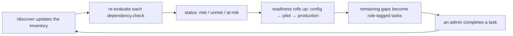
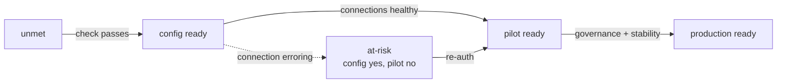
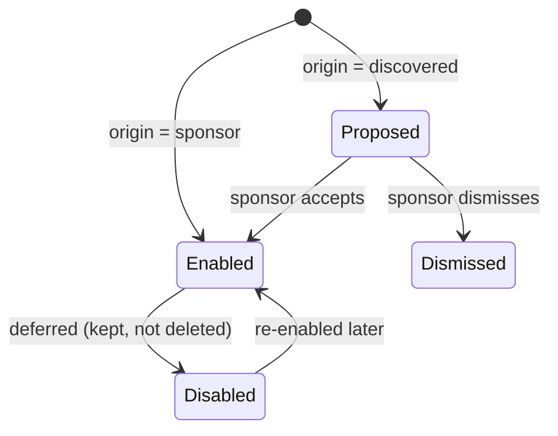
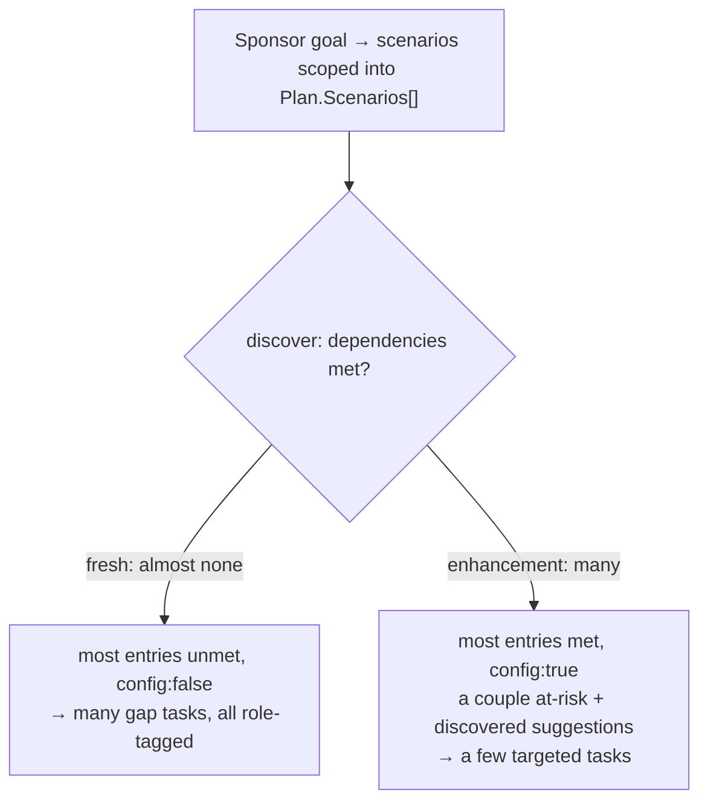

# The updated ESS scenario list — a one-pager

**What it is.** The scenario list is what the ESS scenario planner persists: the sponsor's rollout scope, one entry per scenario area. It lives as an embedded `Scenarios[]` field on the Plan. This page covers the *updated* shape — the four fields we added so discovery can actually drive the plan — with the rationale and the flows.

**Where it lives.** `Project → Plan`, and the Plan carries `Scenarios[]` inline (not a separate entity). The Plan is minted early as a Draft and edited in place with `patchPlan` as goals firm up. Disabling a scenario doesn't delete it — we keep the entry. Multiple plans can be active at once, which is what makes cross-plan overlap ("that's already covered in your HR plan") a simple scan.

---

## The entry, and why each field is there

| Field | Holds | Why it's there |
|---|---|---|
| `id` | stable id | so tasks and evals can point at a scenario without a separate key |
| `area` / `category` | catalogue category | maps to the scenario inventory; also the overlap key across plans |
| `jtbd` | the job to be done | human-readable intent |
| `persona` | Employee / Manager | who the scenario serves |
| `connector` | required connector(s) | what it needs to run |
| `catalogRange` | e.g. `#1-3` | ties back to the catalogue |
| `tier` / `priority` / `confidence` | from the framework | ordering, and how sure we are |
| `deflectionType` | pre-ticket / guided / decision / knowledge | maps to the deflection KPI |
| **`origin`** | `sponsor` \| `discovered` | lets discovery *suggest* a scenario the sponsor didn't ask for |
| `enabled` | in scope? | disable ≠ delete; eval-gen reads `enabled` entries only |
| **`dependencies[]`** | `{kind, need, check, status}` | what must be true — and `check` makes it machine-evaluable |
| **`readiness`** | `{config, pilot, production}` | authored-ready is not the same as pilot-safe |
| **`evaluatedAgainst`** | `{environmentRef, inventoryVersion}` | which inventory snapshot the readiness reflects (staleness) |

The four in bold are the new ones. Everything else was already in the first cut.

---

## The four that make it a *living* plan

The rest of the fields store a snapshot of scope. These four are what let the same list update itself as the environment changes, gate a pilot on health, and surface things the sponsor didn't ask for.

**`dependencies[].check` — so the plan can self-update.** The old `need` was prose ("Workday or SAP SuccessFactors"), which means nothing can flip its status without re-reasoning. A `check` is a small predicate discovery evaluates against the inventory — a connector set, a knowledge-source type, or a capability-matrix category. Now every `/discover` deterministically re-scores the dependency and rolls readiness up. No re-scoping.

**`readiness` as a triplet — so we can gate a pilot.** A single `ready` boolean can't say "configured, but a connection is erroring, so don't pilot it yet." Splitting readiness into `config` / `pilot` / `production` — plus an `at-risk` dependency status for "present but unhealthy" — lets a scenario be `config:true, pilot:false`. That's the runtime-health gate the planner surfaces.

**`origin` — so discovery can suggest.** `enabled` only splits in-scope from deferred. `origin` distinguishes what the sponsor chose from what discovery found lying around. When SAP turns out to be connected, the planner appends an `origin:"discovered", enabled:false` entry — a suggestion the sponsor can accept or dismiss. Eval-gen ignores suggestions until they're accepted.

**`evaluatedAgainst` — so we know when it's stale.** Readiness is only true as of some inventory snapshot. Recording which one lets a returning sponsor be told "your environment changed, refresh the plan," and ties the plan to the shared inventory without embedding any identifiers.

---

## How it flows

**The living loop — the whole point.** The plan stops being a document and becomes a status board that the admins' work updates.



**Readiness and the at-risk detour.** A scenario climbs from unmet to config-ready to pilot-ready to production-ready — unless a connection is erroring, which parks it at `at-risk` until someone re-auths.



**Enablement — sponsor-chosen vs discovery-suggested.** `origin` and `enabled` together give a scenario four honest states.



**Fresh vs enhancement — the same list, two shapes.** Because readiness comes from `check` against the inventory, the identical schema describes a green-field rollout and an add-on to a live agent.



---

## A worked entry

An IT-ticketing scenario on a tenant where ServiceNow ITSM is connected and its template configs already exist (so config is done), but one ServiceNow connection is erroring (so it's not pilot-safe yet):

```json
{
  "id": "it-ticketing",
  "area": "IT Scenarios", "catalogRange": "#36-38",
  "jtbd": "Create / read / update IT tickets", "persona": "Employee",
  "connector": "ServiceNow ITSM",
  "tier": 2, "priority": 2, "confidence": "High", "deflectionType": "pre-ticket resolution",
  "origin": "sponsor", "enabled": true,
  "dependencies": [
    { "kind": "connector", "need": "ServiceNow ITSM",
      "check": { "kind": "capability", "category": "IT Scenarios" }, "status": "at-risk" }
  ],
  "readiness": { "config": true, "pilot": false, "production": false },
  "evaluatedAgainst": { "environmentRef": "env-…", "inventoryVersion": "2026-07-22T…" }
}
```

`config:true` because the connector and its template configs are already there (reuse — author the topic only); `pilot:false` because a connection is `at-risk`, which spawns one task: *re-auth the failing ServiceNow connection*.

And a scenario the sponsor never asked for, surfaced because SAP turned out to be connected:

```json
{
  "id": "manager-scenarios", "area": "Manager Scenarios", "catalogRange": "#26-31",
  "origin": "discovered", "enabled": false,
  "dependencies": [
    { "kind": "connector", "need": "SAP SuccessFactors",
      "check": { "kind": "connector", "anyOf": ["sap"] }, "status": "met" }
  ],
  "readiness": { "config": true, "pilot": true, "production": false }
}
```

`origin:"discovered", enabled:false` — it shows up as "you could also add this," and stays out of eval generation until the sponsor accepts it.

---

## What's deliberately not here

- **No golden prompts, no eval runs or results.** Eval generation and storage are a separate skill that *reads* the enabled entries.
- **No tasks or role assignment.** Tasks are the Execution Plan capability. Each task carries a `requiredRole` (reusing FlightCheck's `ENTRA_ADMIN` / `WORKDAY_ADMIN` / … taxonomy), the sponsor assigns it from a Graph-sourced role-holder list, and the assigned admin picks it up from a role-scoped inbox. The scenario list stops at scope and readiness; that assignable-task flow is the paired capability.
